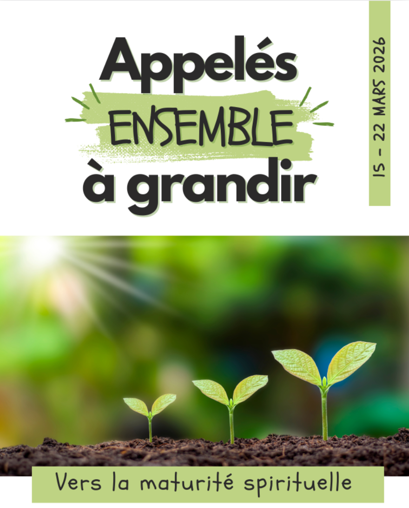

## Ensemble, par la foi

_“Que la Parole de Christ réside au milieu de vous dans toute sa richesse.” Col 3.16_

Quel privilège d’avoir accès à un trésor tel que la Parole de Dieu ! C’est pourquoi nous vous invitons pour cette nouvelle semaine de prière, à étudier le livre de Ruth.

Nous verrons comment cette histoire en apparence ordinaire nous encourage à méditer sur nos vies : comment voyons-nous la Providence de Dieu dans notre quotidien ? Comment vivons-nous les périodes d’épreuves, les temps de silence de Dieu ?

Au fur et à mesure de la lecture, nous apprendrons à ne pas négliger ou mépriser l’ordinaire, mais à y discerner la providence extraordinaire de Dieu. Nous prions que ces méditations soient une précieuse occasion de rencontrer Dieu par Sa Parole.

## Rencontres de la semaine

- **Lundi 31 mars à 12h30** : Prière à l’église, par zoom et selon le secteur de travail
- **Mardi 1er avril à 20h30** : Soirée de louange et prière
- **Jeudi 3 avril à 20h** : Réunion de prière interéglises dans les locaux de l’ADD, 86 Cours Berriat à Grenoble
- **Vendredi 4 avril à 12h30** : Prière à l’église, par zoom et selon le secteur de travail
- **Samedi 5 avril à 9h30** : Prière autour d’un brunch à l’église
- **Dimanche 6 avril à 10h15** : Culte de louange, suivi d’une Agape et d’une sortie/balade (selon la météo)

## Je participe en ligne

- [Dimanche 30](dimanche.md)
- [Lundi 31](lundi.md)
- [Mardi 1er](mardi.md)
- [Mercredi 2](mercredi.md)
- [Jeudi 3](jeudi.md)
- [Vendredi 4](vendredi.md)
- [Samedi 5](samedi.md)
- [Dimanche 6](dimanche2.md)
