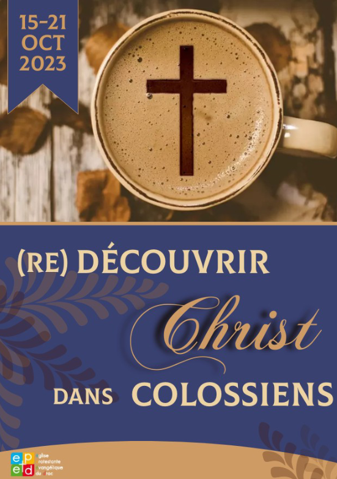

# Semaine de prière - Aimer l'essentiel !

<h1>Aimer l’essentiel</h1>

Quels sont les effets de la connaissance et de l’amour de Dieu dans votre vie ? 
Comment « aimer selon le coeur de Dieu », dans notre quotidien, au travail, quand c’est difficile, ou même quand on n’en a pas envie ?

Nous vous proposons pour cette semaine de prière d’approfondir le thème de l’année, et de survoler le livre «  Un moi pour aimer l’essentiel » de Gilles Geiser. 
Ce livre propose un parcours de 30 jours d’approfondissement des deux commandements les plus importants selon Jésus : Aimer Dieu et aimer son prochain. 
Le but de ce cheminement de 7 jours, ce n’est pas uniquement que nous en sachions plus sur Dieu, mais que les cercles relationnels, familiaux et professionnels dans lesquels nous vivons perçoivent la transformation que produit l’Evangile dans une vie.

Plusieurs occasions nous sont données dans la semaine pour vivre ce temps de prière tous ensemble. Profitons-en !

<h1>Je participe avec les autres</h1>

- Dimanche 13 Mars, 10H15 
Culte de louange

- Mardi 15 Mars, 20H30-22H00 
Prière tous ensemble à l’église

- Jeudi 17 OU Vendredi 18 Mars, 20H15 -22H00 
Prière dans les groupes de quartier

- Samedi 19 Mars, 9h30 - 11h 
 Atelier féminin à l’église

- Samedi 19 Mars 12h à 16h30
 Prions ensemble, coeur à coeur avec Dieu - Durant cet après-midi, nous voudrions clôturer la semaine par un bouquet de prières ensemble et en continu. Chacun sera invité à suivre un chemin de prières et ainsi rendre vivantes l'adoration, l'intercession, la louange et la confession.  
Vous aurez la possibilité de venir prier le temps que vous souhaitez. Une demi-heure, une heure, plus encore si tel est votre souhait ou bien l'après-midi entière... Il vous sera proposé des temps ensemble, en groupe, sur des sujets et supports ciblés, mais aussi la possibilité  d'aller prier en binôme dans le quartier pour le quartier. Ainsi que des temps spécifiques plus intimes pour prier pour vos besoins personnels

- Samedi 19 Mars, 17h à 21h30 
 Rencontre pour les jeunes 12/25 ans  à l’église, Au programme : jeux, partage, témoignages, prière et pizza !!!

- Dimanche 20 mars, 10h15 
Culte

<h1>Je participe en ligne</h1>

- [Dimanche](dimanche.md)
 13 - L’essentiel
- [Lundi](lundi.md)
 14 - Tu aimeras
- [Mardi](mardi.md)
 15 - Le Seigneur ton Dieu
- [Mercredi](mercredi.md)
 16 - De tout ton coeur transformé
- [Jeudi](jeudi.md)
 17 - De toute ton âme guérie
- [Vendredi](vendredi.md)
 18 - De toute ta pensée renouvelée
- [Samedi](samedi.md)
 19 - De toute ta force, en action
- [Dimanche de clôture](dimanche2.md)
 20 - Ton prochain comme toi-même
